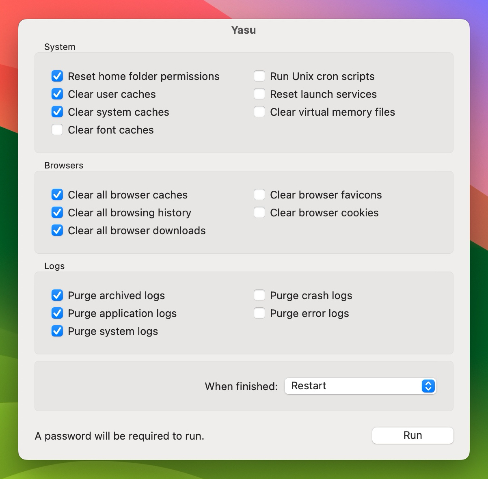

If you’ve landed on this page, you are either a Yasu user from long ago (👋🏻 hello again!), or have heard about Yasu from someone who once was themselves. Whichever the case, I’m humbled that my little app was interesting enough for you to look for it.

If you just landed here hoping to download the latest version for an old Mac you have, they’re still available on the [Yasu for Mac](https://yasuformac.com) site. More on that in a bit.

### The History

I first created Yasu (short for “Yet another system utility”) back in 2001 as an answer to [Cocktail](https://www.maintain.se/cocktail/) moving to a shareware model. I thought I’d be able to make something just as useful, so challenged myself to building a Mac utility app.

That very first version was really ugly, but it laid the groundwork for something that eventually grew into a successful Mac app over the next 15+ years.

Ironically, I took Yasu to a shareware model at some point too. I was completely blown away that people were willing to pay me for my hobby project. I didn’t get rich from it, but I was able to use the proceeds to pay for hosting and other online services.

It also lead to speaking gigs at Mac User Groups and a couple of small local Mac conferences. The app was even featured in print magazines a few times. I still have my cherished copy of MacWorld that has a write up on the app. When this issue dropped, I considered myself pretty damn lucky and thought I’d made the big time.

But, as times changed, and Mac OS became macOS, it became harder to maintain the app thanks to Apple moving to a sandboxed operating system. Where it was once easy to issue Unix commands to clean a system level cache became a total obstacle. There were more and more roadblocks to overcome to keep the app alive.

This led me to turn the app over to another developer back in 2017 who promised me he would keep it going, but sadly, that’s not what ended up happening. He updated it a time or two and then just let it sit for the years since, doing nothing.

I think the existing binaries are still usable on older Macs. To be honest, I haven’t tried them lately myself. Give it a shot and let me know if you do.

### The Future

I’ve often toyed with the idea of taking Yasu back and resurrecting development. It would mean a complete rewrite in a completely different language which would be a challenge, but if there was enough interest, I might just be persuaded to give it a try. It would give me a passion project to work on again too.

**This is where you come in...**

If you’re interested in seeing a Yasu resurrection, [contact me](mailto:hello@jimmitchell.dev) or let me know on [Mastodon](https://social.lol/@jim). Your message or toot might just be that one motivator that pushes me over the edge to get off my butt.

Whatever the future holds, thanks so much for being curious about Yasu. It means a lot that there are still people like you looking for it. ✌🏻
