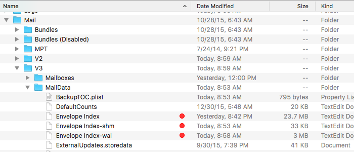
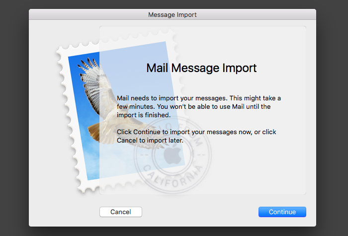

Some time ago, I set up my Gmail account in Apple Mail to copy over messages which were not sent to my jimmitchell.org account. I’m one of those guys who likes to have everything all in one place at my finger tips when I need it.

After copying over the messages I wanted, I completely removed the Gmail IMAP account from Mail and went about my business. Soon after, when I went searching for a specific email, I experienced the phenomenon of ghost emails in the search results.

These are messages that Mail once knew about, but no longer knows where they exist. The ghost emails were all from the since removed Gmail account.

If you’re experiencing the same problem, here’s a very simple fix to rebuild the Apple Mail envelope index.

First, quit Apple Mail if it’s running, then navigate your way to `~/Library/Mail/` (where "~" is your home folder) in the Finder. Once you’re in the Mail folder, you’ll see a file named “Envelope Index” which keeps track of where all messages are located. Rename “Envelope Index” to “Envelope Index Backup” (We don’t want to trash the file just yet).

Then, relaunch Apple Mail. You’ll be presented with a daunting “Message Import” dialog that looks like your email account was wiped out and you’re starting all over. Fear not. You’re simply rebuilding the Envelope Index at this point.

Click "Continue" to rebuild the index. Once it’s done, all those pesky phantom messages will be gone the next time you perform a search in Mail (Yay!). You can then go back to the `~/Library/Mail/` folder in the Finder and move the file you renamed to "Envelope Index Backup" to the Trash.

And there it is. Your Apple Mail Envelope index has been rebuilt. A very simple solution to a problem that has baffled some of the best Mac users.
