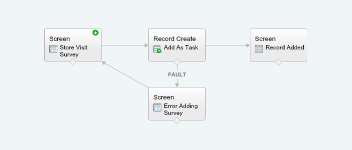

I was asked to find a solution for our field reps that would simplify the process of adding a completed task to their activities when they visited one of our retail stores.

We keep our retail locations in Salesforce.com as contacts under a master account, which is shared with all users using a special account sharing rule.

The solution I came up with was a simple flow that limited users to a specific set of enterable information, pre-filling the date of the activity, and marking the task complete when the activity was committed. Literally, the only thing they needed to do was select a picklist value and enter a comment about their visit. It was exactly what we were looking for.



The thing I didn’t like about the flow was that when a user entered it, context kind of got lost – meaning they started out from a contact record, but didn’t have a good visual cue about where they were once they got into the flow.

Sure, the flow was simple, but to me it’s still poor UX not to know the context of your work at all times. So, I decided to use a Visualforce page to solve the problem:

```html
<apex:page standardController="Contact">
    <apex:sectionheader title="Add Retail Store Visit" subtitle="{!Contact.Name}"></apex:sectionheader>
    <flow:interview name="Retail_Store_Visit">
        <apex:param name="vContact" value="{!Contact.Id}"></apex:param>
        <apex:param name="vAccount" value="{!Contact.Account.Id}"></apex:param>
    </flow:interview>
</apex:page>
```

The trouble with this was that after the flow data was committed, the user would be returned to the beginning of the flow. That’s definitely not what I wanted. I needed to go back to the contact record I started from.

So I added the `finishLocation` attribute to the `<flow:interview />` component tag. It would make sense that if I passed the Contact Id, the flow should return to the Contact record:

```html
<flow:interview name="Retail_Store_Visit" finishLocation="{!URLFOR('/' + Contact.Id)}">
    <apex:param name="vContact" value="{!Contact.Id}"></apex:param>
    <apex:param name="vAccount" value="{!Contact.Account.Id}"></apex:param>
</flow:interview>
```

Nope. That didn’t do it. When the flow is entered, context gets lost, so Salesforce doesn’t really know where the user is anymore. Even using the `vContact` Apex parameter didn’t work.

I searched help documentation for an answer, but it wasn’t all that helpful. I searched Communities and came up empty. Then I searched the [Salesforce Stack Exchange](http://salesforce.stackexchange.com/), where the only solution I could find was really convoluted, and didn’t even come close to solving my problem. I was vexed.

Taking a break to get a cup of coffee, a solution dawned on me that turned out to be pretty darned simple. All I needed was an Apex variable in the page, which I could pass to the `finishLocation` component tag once the flow was complete. Oddly enough, this method is not documented – at least not that I could find.

So…the final Visualforce page:

```html
<apex:page standardController="Contact">
    <apex:variable var="theContact" value="{!Contact.Id}"></apex:variable>
    <apex:sectionheader title="Add Retail Store Visit" subtitle="{!Contact.Name}"></apex:sectionheader>
    <flow:interview name="Retail_Store_Visit" finishLocation="{!URLFOR('/' & theContact)}">
        <apex:param name="vContact" value="{!Contact.Id}"></apex:param>
        <apex:param name="vAccount" value="{!Contact.Account.Id}"></apex:param>
    </flow:interview>
</apex:page>
```

Using the Apex variable, users where returned to the contact record they started from, and could see the task they just added in the activity history related list. This was exactly what I was looking for. Everyone was happy.

If you need to return to a starting point when using flows and Visualforce pages, consider giving this solution a try.
